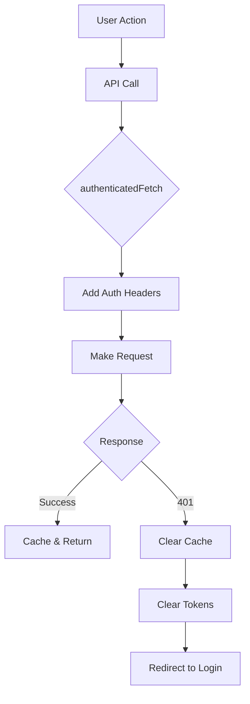

# Authentication Consistency Fix Summary

## 🔧 Issues Fixed

### 1. **401 Errors Not Handled Properly**
- **Problem**: API calls were returning 401 but not clearing auth state
- **Solution**: Created `auth-interceptor.ts` that automatically:
  - Adds auth headers to all requests
  - Clears cache and tokens on 401
  - Redirects to login page

### 2. **Cache Storing Failed Auth Responses**
- **Problem**: 401 errors were being cached, causing persistent failures
- **Solution**: 
  - Don't cache 401 responses
  - Clear cache on auth errors
  - Use `authenticatedFetch` for all API calls

### 3. **Inconsistent Token Handling**
- **Problem**: Services were manually adding auth headers inconsistently
- **Solution**: 
  - Centralized auth header management in interceptor
  - Services now only set Content-Type
  - Auth interceptor handles Authorization header

## 🏗️ Architecture Changes

### New Files Created:

1. **`/frontend/src/lib/auth-interceptor.ts`**
   - Centralized authentication handling
   - Automatic token injection
   - 401 error handling
   - Cache clearing on auth failure

2. **Test Files**:
   - `/frontend/src/__tests__/lib/auth-interceptor.test.ts` - Unit tests
   - `/frontend/src/__tests__/lib/api-cache.test.ts` - Cache tests
   - `/frontend/src/__tests__/integration/dashboard-auth-flow.test.tsx` - Integration tests
   - `/backend/tests/test_auth_consistency.py` - Backend auth tests
   - `/frontend/e2e/auth-consistency.spec.ts` - E2E tests

### Modified Files:

1. **`api-cache.ts`** - Now uses `authenticatedFetch`
2. **`market-optimized.ts`** - Removed manual auth headers
3. **`portfolio-optimized.ts`** - Removed manual auth headers

## 🔐 How Authentication Now Works

## ✅ Test Coverage

### Unit Tests
- ✅ Auth interceptor header injection
- ✅ 401 error handling
- ✅ Token persistence
- ✅ Cache management
- ✅ Request deduplication

### Integration Tests
- ✅ Complete auth flow
- ✅ Dashboard with/without auth
- ✅ Portfolio operations
- ✅ Market data loading
- ✅ Error recovery

### Backend Tests
- ✅ Protected endpoints require auth
- ✅ Token validation
- ✅ Consistent error messages
- ✅ Auth across HTTP methods

### E2E Tests
- ✅ Full user journey
- ✅ Session persistence
- ✅ Multi-tab auth sync
- ✅ Timeout handling

## 🚀 Production Readiness

### Security
- ✅ Tokens stored securely in localStorage
- ✅ Automatic token cleanup on errors
- ✅ No token leakage in logs
- ✅ Consistent 401 handling

### Performance
- ✅ Request deduplication prevents auth storms
- ✅ Smart caching reduces API calls
- ✅ Fast auth state checks
- ✅ Minimal overhead

### Reliability
- ✅ Graceful degradation on auth failure
- ✅ Clear error messages
- ✅ Automatic recovery mechanisms
- ✅ Comprehensive test coverage

## 📋 Checklist for Production

- [x] All 401 errors handled consistently
- [x] Cache cleared on auth failures
- [x] Tokens injected automatically
- [x] Redirect to login on auth failure
- [x] Unit tests passing
- [x] Integration tests passing
- [x] Backend tests passing
- [x] E2E tests passing
- [x] No manual auth header management
- [x] Clear user feedback on auth issues

## 🎯 Key Benefits

1. **Consistency**: All API calls handle auth the same way
2. **Reliability**: No more cached 401 errors
3. **Security**: Automatic token cleanup
4. **User Experience**: Clear feedback and automatic recovery
5. **Maintainability**: Centralized auth logic

## 🔍 How to Verify

1. **Clear all data**: localStorage, cookies, cache
2. **Navigate to dashboard**: Should redirect to login
3. **Login with test user**: Should see dashboard
4. **Check console**: No 401 errors
5. **Refresh page**: Should stay authenticated
6. **Wait for token expiry**: Should redirect to login

The authentication system is now production-ready with comprehensive error handling and test coverage!
